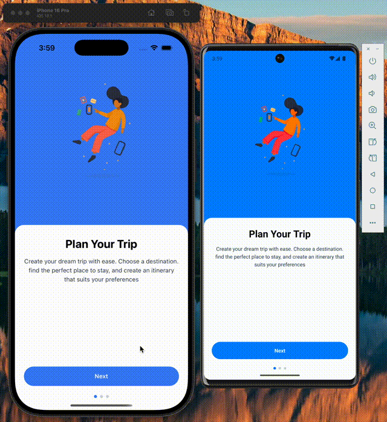
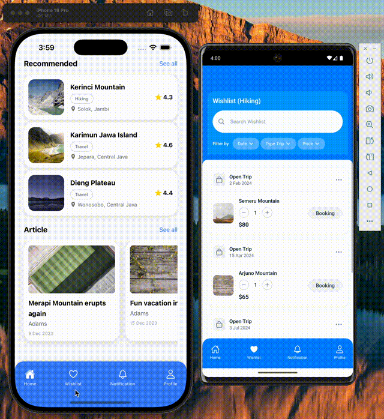

# TripMate 🧳✈️

> Your ultimate travel companion for planning, discovering, and experiencing amazing trips

TripMate is a comprehensive travel planning mobile application built with React Native and Expo. Whether you're looking to plan your dream vacation, find the best travel deals, or discover hidden local gems, TripMate has got you covered.

## ✨ Features

### 🗺️ Trip Planning Made Easy
Plan your dream trip with ease. Choose your destination, find the perfect place to stay, and create an itinerary that suits your preferences.

### 💰 Best Travel Deals
Save time and money by finding the best travel deals. We provide a range of exclusive promotions and discounts to make your trip more affordable.

### 🏛️ Local Attractions Discovery
Discover the beauty of local places you may never have visited. Experience local life and enjoy authentic experiences in each destination.

### 📱 Core App Features
- **Authentication System** - Secure sign-in and sign-up
- **Trip Management** - Browse, save, and manage your trips
- **Wishlist** - Save your favorite destinations and deals
- **User Profile** - Personalized experience and settings
- **Notifications** - Stay updated with latest deals and trip updates
- **Detailed Views** - Rich content for trips and travel articles

## 🎬 App Demo

### Getting Started & Authentication


*Onboarding flow showing the app's main features and authentication system*

### Trip Discovery & Planning


*Browse through amazing destinations and trip options*

### Trip Details & Management


*Detailed trip views with comprehensive information and booking options*

### Profile & User Experience


*User profile, wishlist management, and personalized features*

## 🚀 Getting Started

### Prerequisites
- Node.js (v18 or higher)
- npm or yarn
- Expo CLI
- iOS Simulator (for iOS development) or Android Emulator (for Android development)

### Installation

1. **Clone the repository**
   ```bash
   git clone <repository-url>
   cd TripMate
   ```

2. **Install dependencies**
   ```bash
   npm install
   # or
   yarn install
   ```

3. **Start the development server**
   ```bash
   npx expo start
   ```

4. **Run on your preferred platform**
   
   In the terminal output, you'll find options to open the app in:
   - [development build](https://docs.expo.dev/develop/development-builds/introduction/)
   - [Android emulator](https://docs.expo.dev/workflow/android-studio-emulator/)
   - [iOS simulator](https://docs.expo.dev/workflow/ios-simulator/)
   - [Expo Go](https://expo.dev/go) - for quick testing on physical devices

## 🛠️ Tech Stack

- **Framework**: React Native with Expo
- **Navigation**: Expo Router (file-based routing)
- **Styling**: NativeWind (Tailwind CSS for React Native)
- **Language**: TypeScript
- **UI Components**: Custom components with modern design
- **State Management**: React hooks and context

## 📱 Supported Platforms

- ✅ iOS
- ✅ Android  
- ✅ Web (Progressive Web App)

## 📂 Project Structure

```
TripMate/
├── app/                    # Main app screens (file-based routing)
│   ├── (tabs)/            # Tab-based navigation screens
│   │   ├── index.tsx      # Home screen
│   │   ├── wishlist.tsx   # Wishlist screen
│   │   ├── profile.tsx    # Profile screen
│   │   └── notification.tsx # Notifications
│   ├── auth.tsx           # Authentication screen
│   ├── intro.tsx          # Onboarding screens
│   ├── detail_trip.tsx    # Trip details
│   └── detail_article.tsx # Article details
├── components/            # Reusable UI components
├── constants/             # App constants and themes
├── assets/               # Images, fonts, and static assets
├── hooks/                # Custom React hooks
└── gifs/                 # Demo GIFs for documentation
```

## 🎨 Design Features

- Modern and intuitive user interface
- Smooth animations and transitions
- Responsive design for all screen sizes
- Beautiful imagery and iconography
- Accessibility-focused design

## 🚀 Development

### Running in Development Mode

```bash
# Start the Expo development server
npm start

# Run on specific platforms
npm run android    # Android
npm run ios        # iOS
npm run web        # Web
```

### Building for Production

```bash
# Build for all platforms
expo build

# Platform-specific builds
expo build:android
expo build:ios
```

## 📄 License

This project is licensed under the MIT License - see the [LICENSE](LICENSE) file for details.

## 🤝 Contributing

We welcome contributions! Please feel free to submit a Pull Request.

---

<div align="center">
  <p>Made with ❤️ for travelers around the world</p>
  <p>Happy traveling with TripMate! 🌍✈️</p>
</div>
